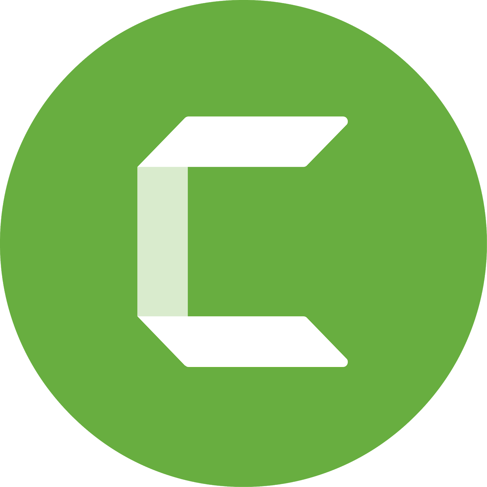
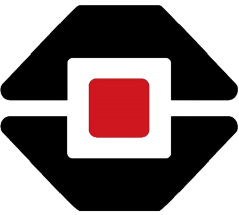

#  **_Hello There!_** 👋

[](https://git.io/typing-svg)

<div align=center>

---

  <a href="https://github.com/kaka-jaques">
  
  
  

<details open align="left">
  <summary>TEMPO TOTAL DE PROGRAMAÇÃO DESDE O INICIO DO CURSO EM 23/05/2022</summary>
    
</details>

---

## 🌐 **_Social_** 🌐

<a href="https://www.instagram.com/kalil.jar" target="_blank"></a>
<a href = "https://mail.google.com/mail/u/0/?fs=1&to=kjfakhouri@gmail.com&su=CONTACT BY GITHUB - HELLO KALIL&body=Olá+Kalil%20J.%20Fakhouri,+Tudo+bem?&tf=cm" target="_blank"></a>
<a href = "https://www.youtube.com/channel/UC-ip_rErotjXgDnTnvajkog" target="_blank"></a>
<a href="https://www.linkedin.com/in/kalil-j-fakhouri-1744b321a/" target="_blank"></a>
<a href="https://www.facebook.com/kalil.j.fakhouri.7" target="_blank"></a>

---

<div><br>

## 🤖 **_Stacks and Technologies I most use_** 🤖

  
  
  
  
  
  
  
  
  
  
  
  
  
  
  
  
  
  
  
  
  
  
  
  
  
</div></b>

---

| Sector | Stacks & Technologies |
|--------|-----------------------|
| ☕ **_Backend_** |     |
| 📺 **_Frontend_** |       |
| 📱 **_Mobile_** |  |
| 🛠 **_IDEs_**   |         |
| 🎲 **_Database_** |  
| 🔃 **_Version_**  |    |
| 🎬 **_Video & Image Edition_** |       |
| 💻 **_SO_** |     |
| 📖 **_Learning_** |                |

---

## 🏆 **_Github Achievements_** 🏆

[](https://github.com/kaka-jaques)

---


---

<div align=left>

### 🚀 **_My Setup_** 🚀
```yml
- Name: KADIR (قادر)
- CPU: AMD Ryzen 5 3600 6-Cores 12-Threads @4.20Ghz
- RAM: 32GB (4x8GB) XPG Spectrix D41 @3200Mhz
- GPU: ASUS Cerberus GeForce GTX 1050 OC Edition
- PSU: NOX 600W 80Plus Bronze Semi-Modular
- Mobo: AORUS B450 Pro WiFi ATX
- Storage: 240GB SSD RiseMode / 2TB HD WD Blue
- Display: Concórdia RF66 24" 1080p @144Hz

```

</div>

---


## ☕ **_BUY ME A COFFEE TO SUPPORT ME!_** ☕

<a href="https://www.buymeacoffee.com/kak4k0ur1" target="_blank"></a>


</div>
